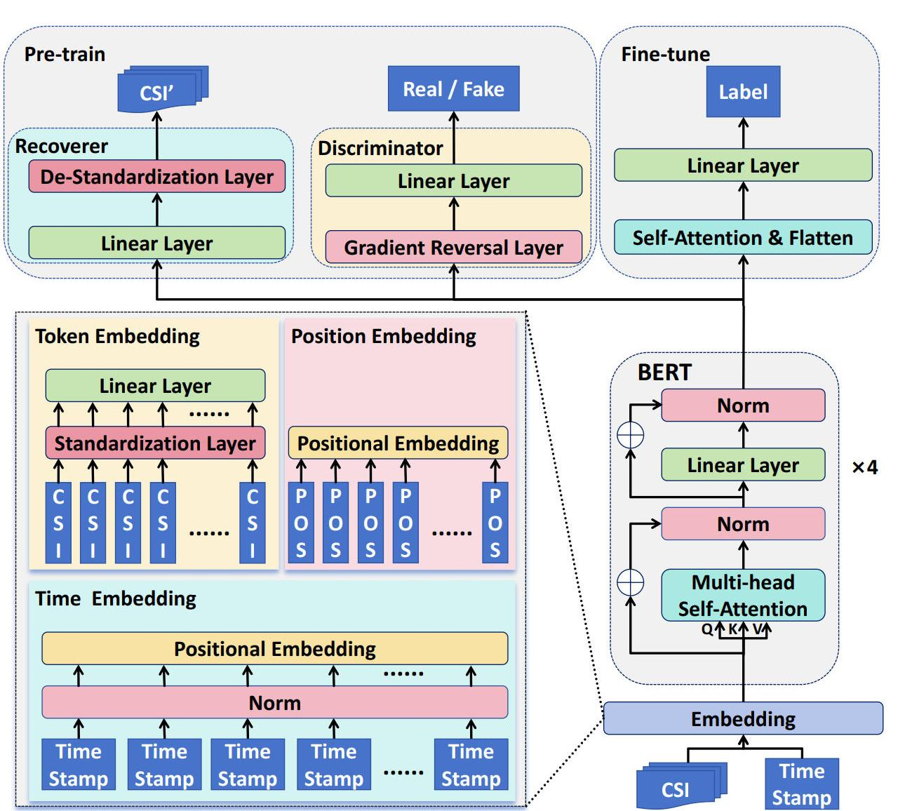
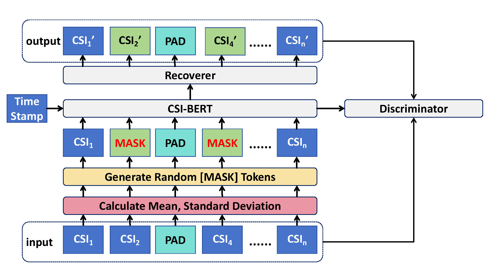
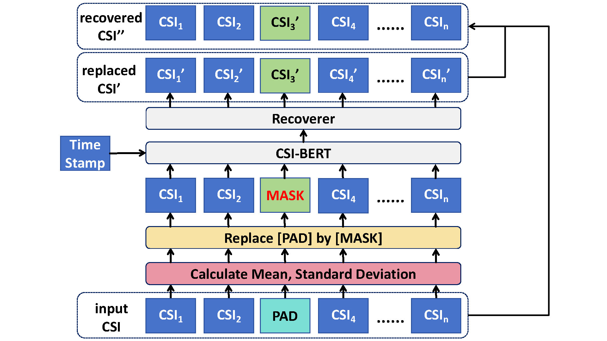

# CSI-BERT

**Article:** Zijian Zhao, Tingwei Chen, Fanyi Meng, Hang Li, XiaoYang Li, Guangxu Zhu*, "[Finding the Missing Data: A BERT-inspired Approach Against Package Loss in Wireless Sensing](https://ieeexplore.ieee.org/document/10620769)", IEEE INFOCOM DeepWireless Workshop 2024

**Patent:** 赵子健, 韩凯峰, 陈琪美, 朱光旭, 李晓阳, 李航, "信道状态信息恢复方法及装置、设备、存储介质"（专利号：ZL2024102321250，2024）

**Notice:** A new version of CSI-BERT will be published at [CSI-BERT2](https://github.com/RS2002/CSI-BERT2), where we have optimized the model and code structure. The CSI-BERT2 can be used for a wider range of tasks. Additionally, we have uploaded our model, pre-trained parameters ([RS2002/CSI-BERT · Hugging Face](https://huggingface.co/RS2002/CSI-BERT), [RS2002/CSI-BERT2 · Hugging Face](https://huggingface.co/RS2002/CSI-BERT2)), and dataset ([RS2002/WiGesture · Datasets at Hugging Face](https://huggingface.co/datasets/RS2002/WiGesture)) to Hugging Face.




## 1.Data

### 1.1 [Dataset](http://www.sdp8.net/Dataset?id=5d4ee7ca-d0b0-45e3-9510-abb6e9cdebf9)

Dynamic part of WiGesture Dataset （./WiGesture）

 [WiGesture Dataset | Papers With Code](https://paperswithcode.com/dataset/wigesture) 


### 1.2 Data Preparation

**We provide a data process example in ./WiGesture/data_process_example**.

The data structure is as follows:

Amplitude, Phase: batch_size , length , (receiver_num * carrier_dim)
TimeStamp: batch_size ,length
Label: batch_size

In our current code version, we do not utilize the phase information as it has been observed to negatively impact the performance of downstream tasks. However, it is worth noting that our model has the capability to successfully recover the lost phase data. If you wish to utilize the phase information, you can concatenate it in the last dimension to the amplitude data.

Furthermore, our dataloader function is specifically designed for our action and people classification task. If you intend to use CSI-BERT for your own task, you will need to create your own dataloader function tailored to your specific requirements.

What’s more, if you wish to use CSI-BERT to recover your own dataset, but your data does not contain timestamp information, you can disable the time embedding (instructions for doing so will be provided in the next section). Additionally, if you intend to use CSI-BERT for downstream tasks but are unsure about the position of the lost CSI, you can also disable the position embedding and solely rely on the time embedding.


## 2.Train

You can refer to our code to see the parameters that can be easily modified through the command line. Here, we will highlight some important parameters.

### 2.1 Pretrain



```bash
python pretrain.py --normal --time_embedding --adversarial --random_mask_percent
```

As mentioned in the previous section, if you want to disable the time embedding, you can run the model using the following command:

```bash
python pretrain.py --normal
```

However, in this case, you may need to make some changes to the data loader. Regardless of the timestamp in your data, it will be ignored by the model.

If you want to disable the position embedding, you can use the following command:

```bash
python pretrain.py --normal --position_embedding_type None
```

If you want to set a fixed mask proportion, you can use:

```bash
python pretrain.py --normal  --time_embedding --adversarial --mask_percent <your mask proportion>
```


### 2.2 Recover



During the recovery phase, you need to maintain the same settings as in the pretraining phase.

```bash
python recover.py --normal --time_embedding --path <full pretrain model path>
```


### 2.3 Finetune

During the finetuning phase, you need to maintain the same settings as in the pretraining phase.

```bash
python recover.py --normal --time_embedding --path <bottom pretrain model path> --class_num <class num> --task <task name>
```

As mentioned earlier, if you want to use CSI-BERT for your own tasks, you will need to make some changes to the dataloader.


# 3 Bug

We have identified a minor bug in the pre-training process. It appears that the issue may be caused by the denominator in the loss function being too small. To address this problem, we have introduced a small adjustment factor to the denominator, which reduces its occurrence. Additionally, we have discovered that using alternative loss functions can mitigate the problem. It is possible that during reverse propagation, the denominator sometimes becomes very close to zero.

If you encounter the same issue during your testing, we suggest trying the following solutions:

1. Rerun the process (as the bug does not occur consistently).
2. Experiment with the aforementioned methods.

We would greatly appreciate it if you could share your own approach for resolving the bug with us. Your contributions are welcome and valuable to us.

**Most Recently: Our current approach is to skip the "NAN" batch so that the "NAN" gradient would not be propagated back to the model.**


## 4 Citation

```
@INPROCEEDINGS{10620769,
  author={Zhao, Zijian and Chen, Tingwei and Meng, Fanyi and Li, Hang and Li, Xiaoyang and Zhu, Guangxu},
  booktitle={IEEE INFOCOM 2024 - IEEE Conference on Computer Communications Workshops (INFOCOM WKSHPS)}, 
  title={Finding the Missing Data: A BERT-Inspired Approach Against Package Loss in Wireless Sensing}, 
  year={2024},
  volume={},
  number={},
  pages={1-6},
  keywords={Deep learning;Wireless communication;Interpolation;Wireless sensor networks;Transformers;Data models;Sensors;Bidirectional Encoder Representations from Transformers;Adversarial Learning;Data Recovery;Channel Statement Information;Wi-Fi Sensing},
  doi={10.1109/INFOCOMWKSHPS61880.2024.10620769}}
```

