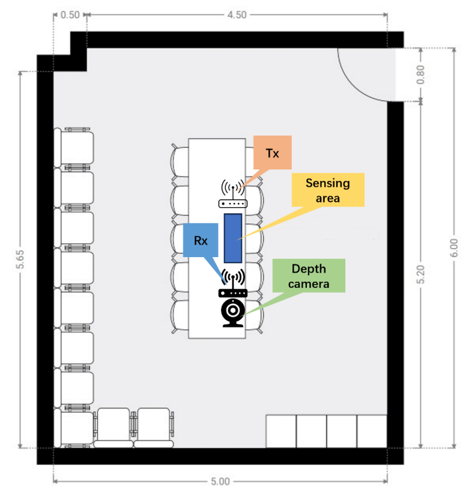

# WiGesture: Wireless Sensing Dataset for Gesture Recognition and People ID Identification with ESP32-S3

## 1. Dataset Overview

WiGesture dataset contains data related to gesture recognition and people id identification in a meeting room scenario. The dataset provides synchronised CSI, RSSI, and timestamp for each sample. It can be used for research on **WiFi-based human gesture recognition and people id identification**.

## 2. Data Format

The WiGesture dataset consists of multiple .csv files, each representing a continuous 60-second sample. The dataset contains the following columns:

1. Column B - "seq": This column indicates the row number of each entry.
2. Column C - "timestamp" and Column V - "local_timestamp": These columns represent the UTC+8 time and ESP local time, respectively, when the data was collected.
3. Column G - "rssi": This column represents the RSSI signal.
4. Column AB - "data": This column contains the CSI data. Each row consists of 104 numbers, which can be divided into pairs representing the real and imaginary parts of each subcarrier. Therefore, the complex CSI value of the ith subcarrier can be obtained as a[2i] + a[2i+1]j. In other words, the CSI value of the 52 subcarriers can be represented as [a[1]+a[2]j, a[3]+a[4]j, ..., a[103]+a[104]j].
5. Other columns: These columns provide additional information from the ESP32 device, such as MAC and MCS details.

## 3. Data Collection Detail

|                |                         |
| -------------- | ----------------------- |
| Frequency Band | 2.4Ghz                  |
| Bandwidth      | 20 MHz (52 subcarriers) |
| Protocol       | 802.11n                 |
| Waveform       | OFDM                    |
| Sampling rate  | About 100Hz             |
| Antenna        | 1 antenna per device    |

Data collection is performed in an indoor scenario, where the black icons indicate the position of the receivers and camera, and the white transmitter. Heavy lines indicate walls. The blue square is the soft pad that prevents the volunteers from injuries.

**We will provide the version modal data synchronised with the Wi-Fi signal of the static part in future.**

## 4. File Tree Structure

The filename represents the gesture of the sample, while its parent root indicates the person's ID.

**The "Dynamic" folder contains various dynamic gestures, such as applause, while the "Static" folder includes static digital gestures ranging from number 1 to 9. The people IDs in the two folders correspond to each other.**

 Root Directory
  |
  |--Dynamic
  |  |
  |  |-- ID1
  |  |    |
  |  |    |-- applause.csv
  |  |    |-- circleclockwise.csv 
  |  |    |-- frontandafter.csv
  |  |    |-- leftandright.csv
  |  |    |-- upanddown.csv
  |  |    |-- waveright.csv
  |  |
  |  |-- ID2
  |  |    |
  |  |    |-- applause.csv
  |  |    |-- circleclockwise.csv 
  |  |    |-- frontandafter.csv
  |  |    |-- leftandright.csv
  |  |    |-- upanddown.csv
  |  |    |-- waveright.csv
  |  |
  |  |-- ID3
  |  |    |
  |  |    |-- applause.csv
  |  |    |-- circleclockwise.csv 
  |  |    |-- frontandafter.csv
  |  |    |-- leftandright.csv
  |  |    |-- upanddown.csv
  |  |    |-- waveright.csv
  |  |
  |  |-- ID4
  |  |    |
  |  |    |-- applause.csv
  |  |    |-- circleclockwise.csv 
  |  |    |-- frontandafter.csv
  |  |    |-- leftandright.csv
  |  |    |-- upanddown.csv
  |  |    |-- waveright.csv
  |  |
  |  |-- ID5
  |  |    |
  |  |    |-- applause.csv
  |  |    |-- circleclockwise.csv 
  |  |    |-- frontandafter.csv
  |  |    |-- leftandright.csv
  |  |    |-- upanddown.csv
  |  |
  |  |-- ID6
  |  |    |
  |  |    |-- applause.csv
  |  |    |-- circleclockwise.csv 
  |  |    |-- frontandafter.csv
  |  |    |-- leftandright.csv
  |  |    |-- upanddown.csv
  |  |    |-- waveright.csv
  |  |
  |  |-- ID7
  |  |    |
  |  |    |-- applause.csv
  |  |    |-- circleclockwise.csv 
  |  |    |-- frontandafter.csv
  |  |    |-- leftandright.csv
  |  |    |-- upanddown.csv
  |  |    |-- waveright.csv
  |  |
  |  |-- ID8
  |  |    |
  |  |    |-- applause.csv
  |  |    |-- circleclockwise.csv 
  |  |    |-- frontandafter.csv
  |  |    |-- leftandright.csv
  |  |    |-- upanddown.csv
  |  |    |-- waveright.csv
  |--Static
  |  |
  |  |-- ID1
  |  |    |
  |  |    |-- Gesture1.csv
  |  |    |-- Gesture2.csv
  |  |    |-- Gesture3.csv
  |  |    |-- Gesture4.csv
  |  |    |-- Gesture5.csv
  |  |    |-- Gesture6.csv
  |  |    |-- Gesture7.csv
  |  |    |-- Gesture8.csv
  |  |    |-- Gesture9.csv
  |  |-- ID2
  |  |    |
  |  |    |-- Gesture1.csv
  |  |    |-- Gesture2.csv
  |  |    |-- Gesture3.csv
  |  |    |-- Gesture4.csv
  |  |    |-- Gesture5.csv
  |  |    |-- Gesture6.csv
  |  |    |-- Gesture7.csv
  |  |    |-- Gesture8.csv
  |  |    |-- Gesture9.csv
  |  |-- ID3
  |  |    |
  |  |    |-- Gesture1.csv
  |  |    |-- Gesture2.csv
  |  |    |-- Gesture3.csv
  |  |    |-- Gesture4.csv
  |  |    |-- Gesture5.csv
  |  |    |-- Gesture6.csv
  |  |    |-- Gesture7.csv
  |  |    |-- Gesture8.csv
  |  |    |-- Gesture9.csv
  |  |-- ID4
  |  |    |
  |  |    |-- Gesture1.csv
  |  |    |-- Gesture2.csv
  |  |    |-- Gesture3.csv
  |  |    |-- Gesture4.csv
  |  |    |-- Gesture5.csv
  |  |    |-- Gesture6.csv
  |  |    |-- Gesture7.csv
  |  |    |-- Gesture8.csv
  |  |    |-- Gesture9.csv
  |  |-- ID5
  |  |    |
  |  |    |-- Gesture1.csv
  |  |    |-- Gesture2.csv
  |  |    |-- Gesture3.csv
  |  |    |-- Gesture4.csv
  |  |    |-- Gesture5.csv
  |  |    |-- Gesture6.csv
  |  |    |-- Gesture7.csv
  |  |    |-- Gesture8.csv
  |  |    |-- Gesture9.csv
  |  |-- ID6
  |  |    |
  |  |    |-- Gesture1.csv
  |  |    |-- Gesture2.csv
  |  |    |-- Gesture3.csv
  |  |    |-- Gesture4.csv
  |  |    |-- Gesture5.csv
  |  |    |-- Gesture6.csv
  |  |    |-- Gesture7.csv
  |  |    |-- Gesture8.csv
  |  |    |-- Gesture9.csv
  |  |-- ID7
  |  |    |
  |  |    |-- Gesture1.csv
  |  |    |-- Gesture2.csv
  |  |    |-- Gesture3.csv
  |  |    |-- Gesture4.csv
  |  |    |-- Gesture5.csv
  |  |    |-- Gesture6.csv
  |  |    |-- Gesture7.csv
  |  |    |-- Gesture8.csv
  |  |    |-- Gesture9.csv
  |  |-- ID8
  |  |    |
  |  |    |-- Gesture1.csv
  |  |    |-- Gesture2.csv
  |  |    |-- Gesture3.csv
  |  |    |-- Gesture4.csv
  |  |    |-- Gesture5.csv
  |  |    |-- Gesture6.csv
  |  |    |-- Gesture7.csv
  |  |    |-- Gesture8.csv
  |  |    |-- Gesture9.csv
